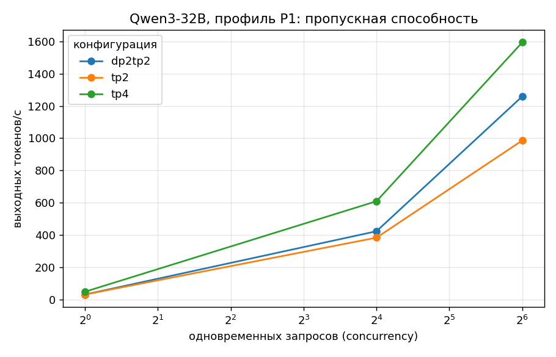
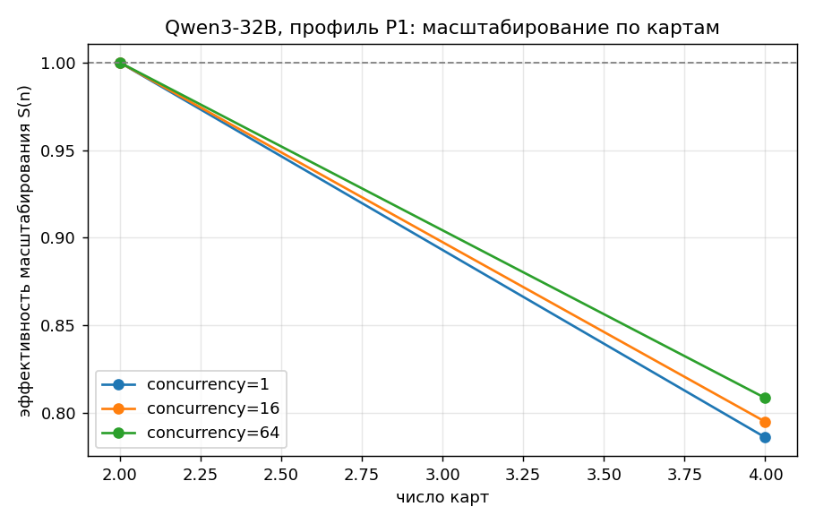
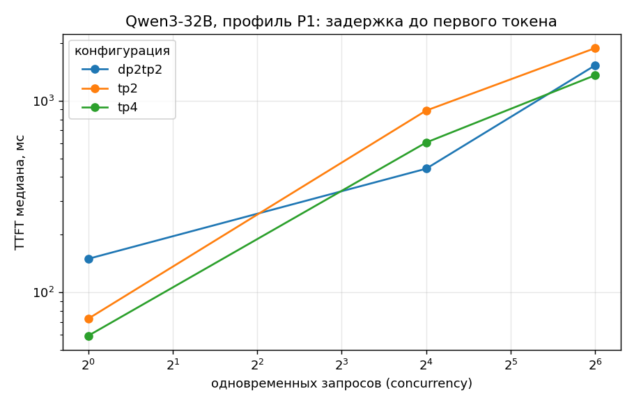

# Qwen3-32B (bf16) на Ascend 910B1: результаты замеров

Движок: **vLLM 0.23.0 + vllm-ascend 0.23.0**, CANN 9.1.0, torch 2.10.0 / torch_npu 2.10.0.post4.
Стенд: 4 × Ascend 910B1 (64 ГБ), openEuler 24.03, дата прогонов — 18–19.09.2026.
Общие условия: `--max-model-len 8192`, `--gpu-memory-utilization 0.9`, датасет `random`,
`--ignore-eos`, seed 1234. Первый прогон каждой конфигурации — разогревочный, в таблицу не входит.

Веса: **62 ГБ**, на одну карту не помещаются — минимальная рабочая конфигурация TP=2 (31 ГБ на карту).
KV-кэш при TP=2 — **193 408 токенов**, это 23.6 запроса по 8192 токена.

## 1. Что прогонялось

| Конфигурация | Карт | Смысл |
|---|---|---|
| `tp2` | 2 | база: минимальный TP, полная сетка профилей P1–P3 |
| `tp4` | 4 | масштабирование по картам (E1) |
| `dp2tp2` | 4 | две реплики по TP=2 против одной на TP=4 |

Профили: **P1** 512→512, **P2** 2048→128, **P3** 256→1024. Параллельность: **1 / 16 / 64**.
Команды запуска — в [`cmd/`](cmd/), логи и телеметрия — в [`logs/`](logs/), полная таблица —
[`table.md`](table.md).

## 2. Пропускная способность

Профиль P1 (512→512), выходных токенов в секунду:

| конфиг | карт | conc=1 | conc=16 | conc=64 | на карту при 64 | ток/Дж при 64 |
|---|---|---|---|---|---|---|
| tp2 | 2 | 30.6 | 383.2 | 986.0 | **493.0** | **2.38** |
| tp4 | 4 | 48.1 | 609.2 | **1594.2** | 398.6 | 2.28 |
| dp2tp2 | 4 | 30.6 | 423.0 | 1259.2 | 314.8 | 1.66 |

Профили P2 и P3 снимались на `tp2`: [`throughput_P2.png`](throughput_P2.png),
[`throughput_P3.png`](throughput_P3.png). Максимум для двух карт — **1115.9 ток/с** на P3
(256→1024, conc=64), минимум — **319.6 ток/с** на P2 (2048→128, conc=64).

## 3. Масштабирование по картам (эксперимент E1)

Модель не помещается на одну карту, поэтому база взята по минимальному работающему TP=2 —
как и предписывает методика для такого случая. S = throughput(4 карты) / (2 × throughput(2 карты)):

| | conc=1 | conc=16 | conc=64 |
|---|---|---|---|
| S при удвоении карт (tp2 → tp4) | 0.79 | 0.79 | **0.81** |

**Для 32B масштабирование заметно лучше, чем для 8B** (там удвоение с 1 до 2 карт давало 0.64–0.76,
а учетверение — 0.37–0.47). Причина в соотношении вычислений и обмена: слои 32B в четыре раза
«толще», на каждый обмен активациями приходится вчетверо больше работы, поэтому доля коммуникации
в общем времени меньше. Это прямая иллюстрация того, что **тензорный параллелизм тем выгоднее,
чем крупнее модель**.

Важно и то, что с ростом параллельности S не падает, а слегка растёт (0.79 → 0.81), тогда как у 8B
при conc=64 она проваливалась до 0.64. У крупной модели коммуникация лучше перекрывается вычислениями.

## 4. Тензорный параллелизм против репликации

При равных четырёх картах и профиле P1:

| conc | tp4 (одна модель на 4 картах) | dp2tp2 (две реплики по 2 карты) | разница |
|---|---|---|---|
| 1 | 48.1 | 30.6 | TP4 быстрее в 1.57× |
| 16 | 609.2 | 423.0 | TP4 быстрее в 1.44× |
| 64 | 1594.2 | 1259.2 | TP4 быстрее в 1.27× |

TP=4 выигрывает на всех уровнях, но разрыв сокращается с ростом нагрузки — то есть репликация
догоняет. При conc=1 результат тривиален: у DP работает только одна реплика из двух, вторая простаивает
(30.6 ток/с — ровно столько же, сколько у одиночного TP=2).

Как и в случае 8B, **потолок в 64 запроса слишком низок, чтобы репликация раскрылась**: каждой из
двух реплик достаётся лишь по 32 запроса. Экстраполяция по кривой tp2 (986 ток/с при 64 запросах на
реплику) даёт для dp2tp2 при conc=128 около 1900 ток/с против 1594 у tp4, то есть точка разворота
ожидается между 64 и 128. Это стоит доснять.

## 5. Задержки и точка насыщения

Критерий методики: медианный TTFT ≤ 2 с и медианный TPOT ≤ 50 мс.

| конфиг | профиль | точка насыщения | что мешает дальше |
|---|---|---|---|
| tp2 | P1 | **16** | при 64 TPOT = 59.4 мс |
| tp2 | **P2** | **не достигнута даже при 1** | при 16 TPOT = 65.2 мс, TTFT = 1.6 с; при 64 TTFT = 5.1 с |
| tp2 | P3 | **16** | при 64 TPOT = 56.0 мс |
| tp4 | P1 | **≥ 64** | остаётся в пределах: TPOT 36.9 мс, TTFT 1.36 с |
| dp2tp2 | P1 | **≥ 64** | TPOT 48.0 мс, TTFT 1.53 с — впритык |

Это главный практический результат по модели: **на двух картах 32B держит интерактивный режим
только до 16 одновременных запросов, на четырёх — все 64**. Причём четыре карты помогают не столько
пропускной способностью, сколько именно задержкой: TPOT падает с 59.4 до 36.9 мс.

Профиль P2 (2048→128) для двух карт непригоден в интерактивном сценарии в принципе: уже при 16
запросах TPOT выходит за 50 мс, а p99 TTFT достигает 3.6 с. При 64 запросах p99 TTFT — **19.7 с**,
то есть очередь на prefill полностью разрушает отзывчивость.

Хвосты задержек показательны отдельно: при tp2/P1/conc=64 ITL p99 = 399.8 мс при медиане около 60 мс,
то есть отдельные токены задерживаются в 6–7 раз дольше обычного. На четырёх картах тот же показатель
вдвое меньше (208.6 мс), а у dp2tp2 — всего 88.6 мс. **Репликация даёт самые ровные хвосты**, потому
что запросы не конкурируют внутри одного батча.

## 6. Утилизация и энергоэффективность

Утилизация AI-ядер по активным картам: пик серии — **76.6 %** (tp2, P3, conc=64), то есть 32B грузит
карты заметно плотнее, чем 8B (максимум 71 %). Самый низкий показатель — на prefill-профиле P2
(41–54 %).

Токенов на джоуль (P1):

| конфиг | карт | conc=1 | conc=16 | conc=64 |
|---|---|---|---|---|
| tp2 | 2 | 0.08 | 1.01 | **2.38** |
| tp4 | 4 | 0.07 | 0.95 | 2.28 |
| dp2tp2 | 4 | 0.05 | 0.59 | 1.66 |

Картина та же, что у 8B: эффективность растёт с параллельностью и падает с числом карт, но разрыв
между tp2 и tp4 здесь минимален (2.38 против 2.28) — снова из-за хорошего масштабирования крупной
модели. Для сравнения, Qwen3-8B на одной карте даёт 10.93 ток/Дж, то есть **в 4.6 раза больше при
в 3.9 раза меньших весах** — соотношение почти линейное по объёму весов.

Оговорка: мощность снималась через `npu-smi` с частотой 0.5 Гц на коротких прогонах, точность оценки
около 10 %.

## 7. Выводы по модели

1. **Минимум для 32B — две карты, рабочий минимум — четыре.** На двух картах модель запускается и
   работает, но интерактивный режим держится лишь до 16 запросов; четыре карты поднимают этот предел
   до 64 и снижают TPOT почти вдвое.
2. **Тензорный параллелизм на крупной модели оправдан:** S = 0.79–0.81 против 0.37–0.47 у 8B.
3. **Репликация выигрывает по ровности выдачи:** ITL p99 в 2.4 раза лучше, чем у TP=4, при меньшей
   пропускной способности. Если важна предсказуемость отклика, а не максимум токенов, DP предпочтительнее.
4. **Длинный prefill — слабое место.** На P2 двухкарточная конфигурация непригодна для интерактива
   при любой параллельности из проверенных.
5. Для одного пользователя 32B даёт 31 ток/с на двух картах и 48 ток/с на четырёх — то есть
   комфортную, но не мгновенную скорость чтения.

## 8. Что осталось недоснятым

- concurrency 128 и 256: не найдена точка разворота между `tp4` и `dp2tp2`, а для четырёхкарточных
  конфигураций не найдена и точка насыщения;
- профили P2 и P3 снимались только на `tp2` — для `tp4` и `dp2tp2` есть лишь P1;
- повторные прогоны (методика требует двух на точку) — снят один, разброс не оценён;
- w8a8-вариант модели: сравнение точности bf16 и w8a8 (эксперимент E2) не проводилось.
