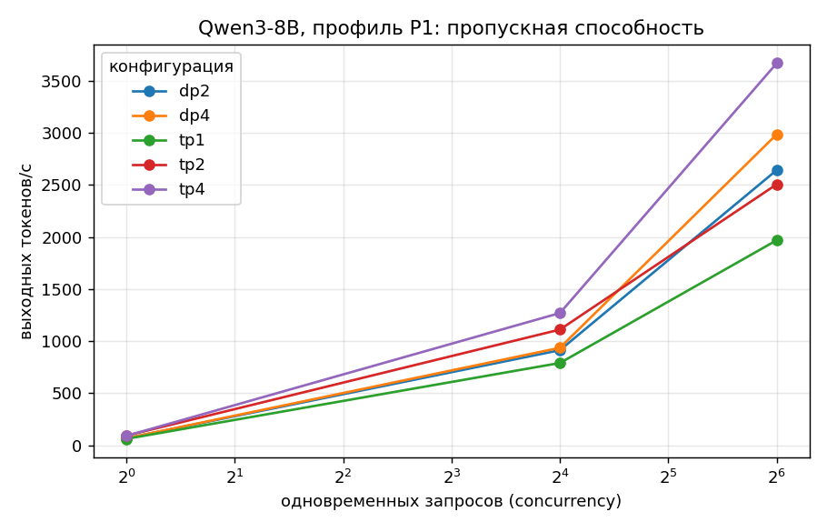
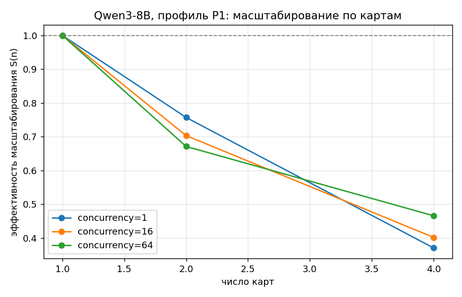
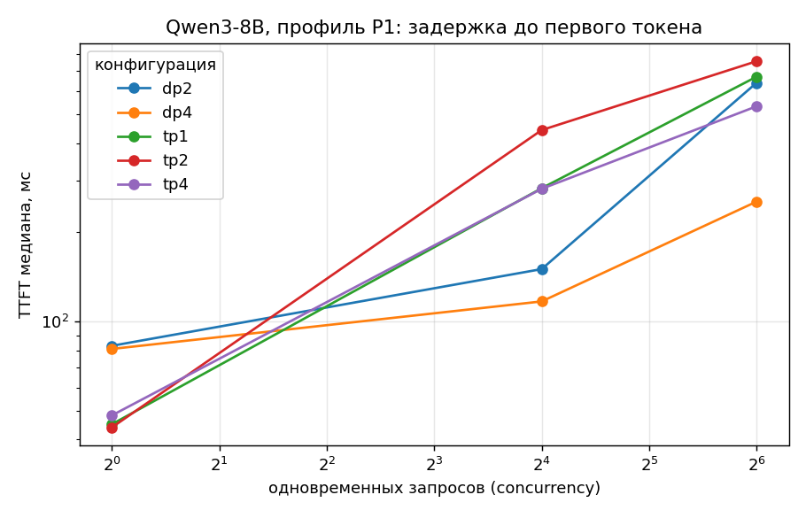

# Qwen3-8B (bf16) на Ascend 910B1: результаты замеров

Движок: **vLLM 0.23.0 + vllm-ascend 0.23.0**, CANN 9.1.0, torch 2.10.0 / torch_npu 2.10.0.post4.
Стенд: 4 × Ascend 910B1 (64 ГБ), openEuler 24.03, дата прогонов — 18.09.2026.
Общие условия: `--max-model-len 8192`, `--gpu-memory-utilization 0.9`, датасет `random`, `--ignore-eos`,
seed 1234. Первый прогон каждой конфигурации — разогревочный, в таблицу не входит.

Веса: 16 ГБ, помещаются на одну карту. KV-кэш при TP=1 — **39.3 ГБ (286 464 токена)**,
это 35 запросов по 8192 токена.

## 1. Что прогонялось

| Конфигурация | Карт | Смысл |
|---|---|---|
| `tp1` | 1 | база: одна карта, полная сетка профилей |
| `tp2` | 2 | масштабирование по картам (E1) |
| `tp4` | 4 | масштабирование по картам (E1) |
| `dp2` | 2 | две независимые реплики модели |
| `dp4` | 4 | четыре реплики, полная сетка профилей |

Профили нагрузки: **P1** 512→512 (симметричный чат), **P2** 2048→128 (извлечение факта, prefill),
**P3** 256→1024 (генерация, decode). Уровни параллельности: **1 / 16 / 64**.

Команды запуска — в [`cmd/`](cmd/), логи серверов, бенчмарков и телеметрия — в [`logs/`](logs/).

## 2. Полная таблица

См. [`table.md`](table.md) — 27 прогонов со всеми метриками. Ниже разбор главного.

## 3. Пропускная способность

Профиль P1 (512→512), выходных токенов в секунду:

| конфиг | карт | conc=1 | conc=16 | conc=64 | на карту при conc=64 |
|---|---|---|---|---|---|
| tp1 | 1 | 60.3 | 789.8 | 1969.7 | **1969.7** |
| tp2 | 2 | 91.3 | 1110.9 | 2507.5 | 1253.8 |
| tp4 | 4 | 89.4 | 1269.8 | **3670.9** | 917.7 |
| dp2 | 2 | 66.3 | 912.9 | 2644.0 | 1322.0 |
| dp4 | 4 | 66.0 | 935.8 | 2987.7 | 746.9 |

Профили P2 и P3 на `tp1` и `dp4`: [`throughput_P2.png`](throughput_P2.png), [`throughput_P3.png`](throughput_P3.png).

Наибольшая пропускная способность серии — **3670.9 ток/с** (tp4, P1, conc=64).
Наибольшая на одну карту — **1969.7 ток/с** (tp1, там же).

## 4. Масштабирование по картам (эксперимент E1)

S(n) = throughput(n карт) / (n × throughput(1 карта)), профиль P1:

| | conc=1 | conc=16 | conc=64 |
|---|---|---|---|
| S(2), TP | 0.76 | 0.70 | 0.64 |
| S(4), TP | 0.37 | 0.40 | 0.47 |

**Масштабирование плохое, и это ожидаемо для модели такого размера.** Причины:

1. **Модель мала относительно карты.** 8B в bf16 — это 16 ГБ на 64 ГБ HBM. При TP=4 на каждую карту
   приходится по 4 ГБ весов, вычислений на слой мало, а обмен активациями между картами (all-reduce
   после каждого слоя внимания и MLP) остаётся. Доля коммуникации в общем времени растёт линейно с TP.
2. **Карты в стенде на разных шинах** (`C1:00.0`, `01:00.0`, `C2:00.0`, `02:00.0`), то есть часть
   обменов идёт между разными корневыми комплексами.
3. **При conc=1 TP помогает по-другому:** TPOT падает с 15.0 до 10.8 мс (tp2) — один запрос считается
   быстрее, потому что вычисления слоя делятся между картами. Но выигрыш 1.4×, а не 2×, и дальше при
   TP=4 он полностью съедается коммуникацией (11.0 мс, то есть хуже чем TP=2).

Практический вывод: **для 8B тензорный параллелизм оправдан только ради задержки одного запроса,
а не ради пропускной способности.** Для пропускной способности выгоднее держать модель на одной карте.

## 5. Тензорный против репликации (TP против DP)

При равном числе карт и conc=64: tp4 = 3670.9 против dp4 = 2987.7 ток/с, то есть TP выигрывает 23 %.
Это противоречит ожиданию, и причина — **в постановке замера, а не в железе**:

- при `--max-concurrency 64` и DP=4 vLLM раздаёт запросы по четырём репликам, каждой достаётся
  только ~16 одновременных запросов, то есть каждая реплика работает в своём неоптимальном режиме
  (ср. dp4 conc=16: 935.8 ток/с — это ~234 ток/с на карту);
- TP=4 при тех же 64 запросах держит один общий батч и загружает карты плотнее.

**Ограничение работы:** максимум 64 одновременных запроса выбран ради скорости прогонов, и этого мало,
чтобы насытить четыре реплики. Ожидаемая точка, где DP обгонит TP, — concurrency порядка 128–256
(по данным tp1: одна карта при 64 запросах даёт 1969.7 ток/с, то есть четыре реплики при 256 запросах
должны дать порядка 7000 ток/с против 3670 у TP=4). Это первое, что стоит доснять.

## 6. Задержки и точка насыщения

Критерий методики: медианный TTFT ≤ 2 с и медианный TPOT ≤ 50 мс.

| конфиг | профиль | точка насыщения |
|---|---|---|
| tp1 | P1 | ≥ 64 (не достигнута) |
| tp1 | **P2** | **16** (при 64 TPOT = 57.5 мс, выход за предел) |
| tp1 | P3 | ≥ 64 (не достигнута) |
| tp2, tp4, dp2, dp4 | P1 | ≥ 64 (не достигнута) |

То есть по интерактивным критериям **8B на одной карте держит 64 одновременных запроса** на чатовой
и генеративной нагрузке. Единственный профиль, где предел найден в пределах сетки, — P2 (2048→128):
длинный prefill забивает планировщик, TPOT растёт до 57.5 мс, а TTFT p99 доходит до 4.6 с.

По хвостам видно, где начинается деградация: при conc=64 на P1 ITL p99 подскакивает
до 121.5 мс (tp1) при медиане ITL около 20 мс — то есть отдельные токены задерживаются в 6 раз
дольше среднего, хотя средние метрики выглядят прилично.

## 7. Энергоэффективность (эксперимент E6)

Токенов на джоуль = выходной throughput / средняя мощность активных карт (P1):

| конфиг | карт | conc=1 | conc=16 | conc=64 |
|---|---|---|---|---|
| tp1 | 1 | 0.35 | 4.64 | **10.93** |
| tp2 | 2 | 0.31 | 4.00 | 8.65 |
| tp4 | 4 | 0.18 | 2.60 | 7.20 |
| dp2 | 2 | 0.25 | 2.91 | 7.64 |
| dp4 | 4 | 0.15 | 1.50 | 4.81 |

Две закономерности:

1. **Энергоэффективность растёт с параллельностью** — от 0.35 до 10.93 ток/Дж, то есть в 31 раз.
   Карта потребляет 170–180 Вт независимо от загрузки (простой — около 95 Вт), поэтому «размазать»
   этот постоянный расход на большее число токенов выгодно.
2. **Любое размножение по картам ухудшает эффективность.** Одна карта — 10.93 ток/Дж, четыре карты
   тензорно — 7.20, четыре реплики — 4.81. Для 8B каждая дополнительная карта добавляет ~100 Вт
   постоянного расхода, а пропорциональной прибавки токенов не даёт.

Оговорка: мощность снималась с частотой 0.5 Гц через `npu-smi`, прогоны короткие (30–120 с),
поэтому числа стоит считать оценкой с точностью около 10 %, а не измерением энергопотребления.

## 8. Утилизация

Утилизация AI-ядер (по активным картам) на пике: 57 % при tp1/P1/conc=64 и 71 % при tp1/P3/conc=64.
То есть **даже в самом плотном режиме карта не загружена полностью**. При этом HBM занята на 92 %:
это следствие `--gpu-memory-utilization 0.9`, то есть память зарезервирована под KV-кэш, а не занята
данными. Узкое место — не вычисления и не объём памяти, а пропускная способность памяти и накладные
расходы планировщика: на decode-профиле (P3) утилизация выше, чем на prefill-профиле (P2, 40.8 %).

## 9. Выводы по модели

1. Для Qwen3-8B на 910B1 **оптимальная конфигурация — одна карта на реплику**: максимум пропускной
   способности на карту (1969.7 ток/с) и максимум энергоэффективности (10.93 ток/Дж).
2. **TP имеет смысл только для снижения задержки** одиночного запроса: TP=2 даёт TPOT 10.8 мс против
   15.0 мс, то есть 92 против 66 ток/с для одного пользователя. TP=4 уже не улучшает ничего.
3. **Одна карта выдерживает 64 одновременных запроса** в чатовом профиле, оставаясь в интерактивных
   пределах по TTFT и TPOT.
4. Наиболее тяжёлый для системы профиль — **длинный prefill (P2)**: именно на нём раньше всего
   деградируют и TPOT, и хвосты TTFT.

## 10. Что осталось недоснятым

- concurrency 128 и 256 — без них точка насыщения на 8B не найдена, а сравнение TP и DP неполно;
- повторные прогоны: методика требует двух прогонов каждой точки с оценкой разброса, здесь снят один;
- профили P4 (8192→512) и P5 (32768→1024) — не снимались, `--max-model-len` был 8192.
